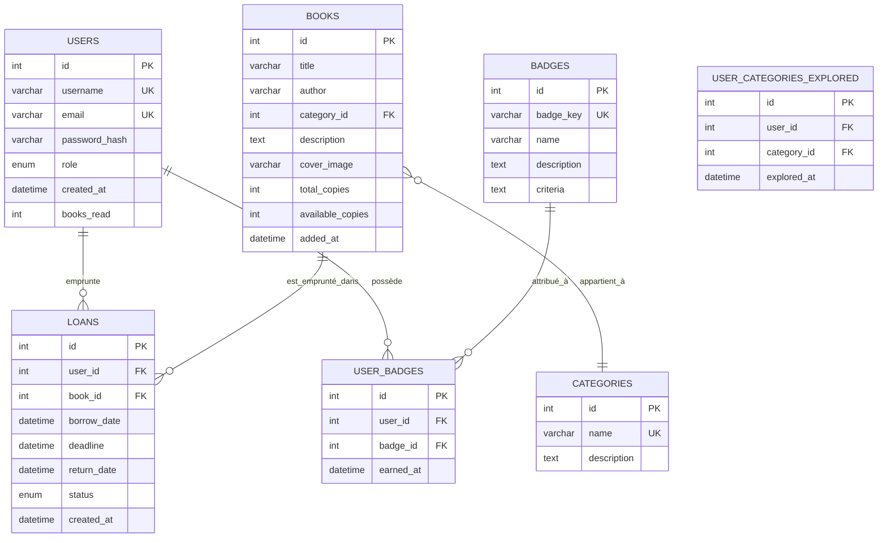
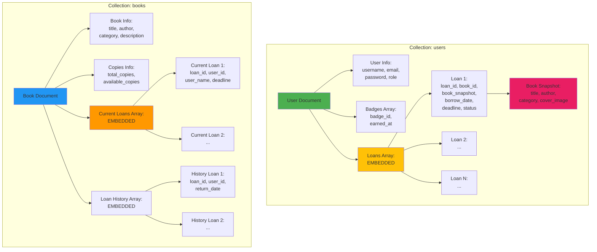

# 📊 Schémas de Base de Données - SQL vs NoSQL

## Comparaison des Approches pour le Système de Bibliothèque

---

## 1. Approche SQL (Relationnelle) - Normalisée

### Schéma Relationnel (3NF - Troisième Forme Normale)



### Requêtes SQL Typiques

#### ❌ **Problème 1 : Obtenir l'historique complet d'un utilisateur**

```sql
-- Requiert 3 JOINS!
SELECT 
    u.username,
    u.email,
    u.books_read,
    l.id as loan_id,
    l.borrow_date,
    l.deadline,
    l.return_date,
    l.status,
    b.title,
    b.author,
    b.cover_image,
    c.name as category
FROM users u
LEFT JOIN loans l ON u.id = l.user_id
LEFT JOIN books b ON l.book_id = b.id
LEFT JOIN categories c ON b.category_id = c.id
WHERE u.id = ?
ORDER BY l.borrow_date DESC;
```

**Problèmes** :
- ❌ 3 JOINs = opération coûteuse
- ❌ Si le livre est supprimé, l'historique perd les infos du livre
- ❌ Performance dégradée avec beaucoup de données

---

#### ❌ **Problème 2 : Statistiques d'emprunts par catégorie**

```sql
-- Requiert 2 JOINS + GROUP BY
SELECT 
    c.name as category,
    COUNT(l.id) as loan_count
FROM loans l
JOIN books b ON l.book_id = b.id
JOIN categories c ON b.category_id = c.id
GROUP BY c.id, c.name
ORDER BY loan_count DESC;
```

---

#### ❌ **Problème 3 : Emprunter un livre (Transaction complexe)**

```sql
-- Étape 1: Vérifier disponibilité
SELECT available_copies FROM books WHERE id = ? FOR UPDATE;

-- Étape 2: Vérifier si user a déjà un livre actif
SELECT COUNT(*) FROM loans 
WHERE user_id = ? AND status IN ('Borrowed', 'Late');

-- Étape 3: Créer le prêt
INSERT INTO loans (user_id, book_id, borrow_date, deadline, status)
VALUES (?, ?, NOW(), DATE_ADD(NOW(), INTERVAL 14 DAY), 'Borrowed');

-- Étape 4: Décrémenter le stock
UPDATE books 
SET available_copies = available_copies - 1 
WHERE id = ?;

-- Étape 5: Incrémenter books_read
UPDATE users 
SET books_read = books_read + 1 
WHERE id = ?;

-- Étape 6: Enregistrer la catégorie explorée
INSERT INTO user_categories_explored (user_id, category_id, explored_at)
SELECT ?, category_id, NOW()
FROM books 
WHERE id = ?
ON DUPLICATE KEY UPDATE explored_at = NOW();

COMMIT;
```

**Problèmes** :
- ❌ 6 requêtes dans une transaction
- ❌ Risque de deadlock
- ❌ Complexité du code

---

### Structure SQL - 7 Tables

```
┌──────────────────┐
│      USERS       │ ──┐
│  - id            │   │
│  - username      │   │
│  - email         │   │
│  - password_hash │   │
│  - role          │   │
│  - books_read    │   │
└──────────────────┘   │
                       │
┌──────────────────┐   │      ┌──────────────────┐
│      BOOKS       │   │      │      LOANS       │
│  - id            │   │──────│  - id            │
│  - title         │   │      │  - user_id (FK)  │
│  - author        │   │──────│  - book_id (FK)  │
│  - category_id   │          │  - borrow_date   │
│  - total_copies  │          │  - deadline      │
│  - avail_copies  │          │  - return_date   │
└──────────────────┘          │  - status        │
         │                    └──────────────────┘
         │
         ▼
┌──────────────────┐          ┌──────────────────┐
│   CATEGORIES     │          │     BADGES       │
│  - id            │          │  - id            │
│  - name          │          │  - badge_key     │
│  - description   │          │  - name          │
└──────────────────┘          │  - description   │
                              └──────────────────┘
                                       │
                                       ▼
                              ┌──────────────────┐
                              │  USER_BADGES     │
                              │  - id            │
                              │  - user_id (FK)  │
                              │  - badge_id (FK) │
                              │  - earned_at     │
                              └──────────────────┘
```

---

## 2. Approche NoSQL (MongoDB) - Dénormalisée

### Schéma MongoDB - Documents Embarqués



### Documents MongoDB Détaillés

#### Document Utilisateur (users collection)

```javascript
{
  "_id": ObjectId("507f1f77bcf86cd799439011"),
  
  // Informations de base
  "username": "Andro",
  "email": "andro@library.com",
  "password": "$2b$12$hashed_password_here",
  "role": "user",
  "created_at": ISODate("2024-01-10T10:30:00Z"),
  
  // Statistiques
  "books_read": 12,
  "categories_explored": ["Classic", "Fantasy", "Science Fiction"],
  
  // Badges embarqués
  "badges": [
    {
      "badge_id": "welcome",
      "earned_at": ISODate("2024-01-10T10:35:00Z")
    },
    {
      "badge_id": "bookworm",
      "earned_at": ISODate("2024-02-05T14:20:00Z")
    },
    {
      "badge_id": "avid_reader",
      "earned_at": ISODate("2024-03-01T09:15:00Z")
    }
  ],
  
  // HISTORIQUE COMPLET DES EMPRUNTS EMBARQUÉ
  "loans": [
    {
      "loan_id": ObjectId("65a1b2c3d4e5f6789abcdef0"),
      "book_id": ObjectId("507f191e810c19729de860ea"),
      
      // SNAPSHOT du livre (données figées au moment de l'emprunt)
      "book_snapshot": {
        "title": "1984",
        "author": "George Orwell",
        "category": "Classic",
        "cover_image": "https://example.com/1984.jpg"
      },
      
      "borrow_date": ISODate("2024-01-15T10:30:00Z"),
      "deadline": ISODate("2024-01-29T10:30:00Z"),
      "return_date": ISODate("2024-01-20T14:45:00Z"),
      "status": "Returned"
    },
    {
      "loan_id": ObjectId("65a1b2c3d4e5f6789abcdef1"),
      "book_id": ObjectId("507f191e810c19729de860eb"),
      
      "book_snapshot": {
        "title": "Harry Potter and the Philosopher's Stone",
        "author": "J.K. Rowling",
        "category": "Fantasy",
        "cover_image": "https://example.com/hp1.jpg"
      },
      
      "borrow_date": ISODate("2024-02-01T09:00:00Z"),
      "deadline": ISODate("2024-02-15T09:00:00Z"),
      "return_date": null,  // Pas encore retourné
      "status": "Borrowed"
    }
    // ... autres emprunts
  ]
}
```

#### Document Livre (books collection)

```javascript
{
  "_id": ObjectId("507f191e810c19729de860ea"),
  
  // Métadonnées du livre
  "title": "1984",
  "author": "George Orwell",
  "category": "Classic",  // Pas de FK, directement stocké!
  "description": "Dystopian social science fiction novel",
  "cover_image": "https://example.com/1984.jpg",
  
  // Gestion du stock
  "total_copies": 5,
  "available_copies": 3,  // Mise à jour atomique avec $inc
  
  "added_at": ISODate("2024-01-01T00:00:00Z"),
  
  // EMPRUNTS ACTUELS EMBARQUÉS
  "current_loans": [
    {
      "loan_id": ObjectId("65a1b2c3d4e5f6789abcdef5"),
      "user_id": ObjectId("507f1f77bcf86cd799439011"),
      "user_name": "Andro",
      "borrow_date": ISODate("2024-03-10T11:00:00Z"),
      "deadline": ISODate("2024-03-24T11:00:00Z"),
      "status": "Borrowed"
    },
    {
      "loan_id": ObjectId("65a1b2c3d4e5f6789abcdef6"),
      "user_id": ObjectId("507f1f77bcf86cd799439012"),
      "user_name": "Ali",
      "borrow_date": ISODate("2024-03-05T15:30:00Z"),
      "deadline": ISODate("2024-03-19T15:30:00Z"),
      "status": "Borrowed"
    }
  ],
  
  // HISTORIQUE DES EMPRUNTS PASSÉS
  "loan_history": [
    {
      "loan_id": ObjectId("65a1b2c3d4e5f6789abcdef0"),
      "user_id": ObjectId("507f1f77bcf86cd799439011"),
      "user_name": "Andro",
      "borrow_date": ISODate("2024-01-15T10:30:00Z"),
      "return_date": ISODate("2024-01-20T14:45:00Z"),
      "status": "Returned"
    },
    {
      "loan_id": ObjectId("65a1b2c3d4e5f6789abcdef3"),
      "user_id": ObjectId("507f1f77bcf86cd799439013"),
      "user_name": "Farah",
      "borrow_date": ISODate("2024-02-10T08:20:00Z"),
      "return_date": ISODate("2024-02-22T16:30:00Z"),
      "status": "Returned"
    }
    // ... autres emprunts passés
  ]
}
```

---

### Requêtes MongoDB Simplifiées

#### ✅ **Solution 1 : Historique d'un utilisateur (1 seule requête!)**

```javascript
// UNE SEULE requête - PAS DE JOIN!
db.users.findOne({ _id: ObjectId("user_id") })
```

**Résultat immédiat** : Toutes les informations (user + tous les emprunts + snapshots des livres)

```javascript
{
  "username": "Andro",
  "books_read": 12,
  "loans": [
    {
      "book_snapshot": {
        "title": "1984",
        "author": "George Orwell"
      },
      "borrow_date": "2024-01-15",
      "status": "Returned"
    }
    // ... tous les autres emprunts déjà là!
  ]
}
```

**Avantages** :
- ✅ **1 seule requête** au lieu de 3 JOINs
- ✅ **Performance optimale** (pas de joins)
- ✅ **Données persistantes** (snapshots conservés même si livre supprimé)

---

#### ✅ **Solution 2 : Statistiques par catégorie (Aggregation Pipeline)**

```javascript
db.users.aggregate([
  { $unwind: "$loans" },
  { 
    $group: {
      _id: "$loans.book_snapshot.category",
      count: { $sum: 1 }
    }
  },
  { $sort: { count: -1 } }
])
```

**Avantages** :
- ✅ Pas de JOINs entre tables
- ✅ Pipeline MongoDB très optimisé
- ✅ Données déjà embarquées

---

#### ✅ **Solution 3 : Emprunter un livre (2 opérations atomiques)**

```javascript
// Opération 1: Ajouter à l'utilisateur (ATOMIQUE)
db.users.updateOne(
  { _id: ObjectId("user_id") },
  {
    $push: {
      loans: {
        loan_id: new ObjectId(),
        book_id: ObjectId("book_id"),
        book_snapshot: {
          title: "1984",
          author: "George Orwell",
          category: "Classic",
          cover_image: "..."
        },
        borrow_date: new Date(),
        deadline: new Date(Date.now() + 14*24*60*60*1000),
        status: "Borrowed"
      }
    },
    $inc: { books_read: 1 }  // Incrément atomique
  }
)

// Opération 2: Mettre à jour le livre (ATOMIQUE)
db.books.updateOne(
  { _id: ObjectId("book_id") },
  {
    $push: {
      current_loans: {
        loan_id: loan_id,
        user_id: user_id,
        user_name: "Andro",
        borrow_date: new Date(),
        deadline: new Date(...),
        status: "Borrowed"
      }
    },
    $inc: { available_copies: -1 }  // Décrément atomique
  }
)
```

**Avantages** :
- ✅ Seulement **2 opérations** (au lieu de 6+ en SQL)
- ✅ Opérations **atomiques** (pas de risque d'incohérence)
- ✅ **Pas de transaction complexe** nécessaire
- ✅ Performance supérieure

---

### Structure NoSQL - 2 Collections

```
┌─────────────────────────────────────────┐
│          Collection: users              │
│  ┌──────────────────────────────────┐   │
│  │  _id: ObjectId                   │   │
│  │  username: "Andro"               │   │
│  │  email: "andro@..."              │   │
│  │  password: "hashed..."           │   │
│  │  role: "user"                    │   │
│  │  books_read: 12                  │   │
│  │  categories_explored: [...]      │   │
│  │                                  │   │
│  │  badges: [                       │   │
│  │    { badge_id: "...", ... }      │   │
│  │  ]                               │   │
│  │                                  │   │
│  │  loans: [                        │◄──┐
│  │    {                             │   │ EMBEDDED!
│  │      loan_id: ObjectId,          │   │ (Pas de FK)
│  │      book_id: ObjectId,          │   │
│  │      book_snapshot: {            │   │
│  │        title: "1984",            │   │
│  │        author: "Orwell",         │   │
│  │        category: "Classic"       │   │
│  │      },                          │   │
│  │      borrow_date: Date,          │   │
│  │      deadline: Date,             │   │
│  │      status: "Borrowed"          │   │
│  │    },                            │   │
│  │    { ... loan 2 ... },           │   │
│  │    { ... loan N ... }            │   │
│  │  ]                               │   │
│  └──────────────────────────────────┘   │
└─────────────────────────────────────────┘

┌─────────────────────────────────────────┐
│          Collection: books              │
│  ┌──────────────────────────────────┐   │
│  │  _id: ObjectId                   │   │
│  │  title: "1984"                   │   │
│  │  author: "George Orwell"         │   │
│  │  category: "Classic"             │   │
│  │  description: "..."              │   │
│  │  cover_image: "https://..."      │   │
│  │  total_copies: 5                 │   │
│  │  available_copies: 3             │   │
│  │                                  │   │
│  │  current_loans: [                │◄──┐
│  │    {                             │   │ EMBEDDED!
│  │      loan_id: ObjectId,          │   │
│  │      user_id: ObjectId,          │   │
│  │      user_name: "Andro",         │   │
│  │      borrow_date: Date,          │   │
│  │      deadline: Date,             │   │
│  │      status: "Borrowed"          │   │
│  │    },                            │   │
│  │    { ... }                       │   │
│  │  ],                              │   │
│  │                                  │   │
│  │  loan_history: [                 │◄──┐
│  │    {                             │   │ EMBEDDED!
│  │      loan_id: ObjectId,          │   │
│  │      user_id: ObjectId,          │   │
│  │      user_name: "Andro",         │   │
│  │      borrow_date: Date,          │   │
│  │      return_date: Date,          │   │
│  │      status: "Returned"          │   │
│  │    },                            │   │
│  │    { ... }                       │   │
│  │  ]                               │   │
│  └──────────────────────────────────┘   │
└─────────────────────────────────────────┘
```

---

## 3. Tableau Comparatif SQL vs NoSQL

| Aspect | SQL (Relationnel) | NoSQL (MongoDB) | Gagnant |
|--------|-------------------|-----------------|---------|
| **Nombre de tables/collections** | 7 tables | 2 collections | ✅ NoSQL |
| **Requête : Historique utilisateur** | 3 JOINs | 1 requête simple | ✅ NoSQL |
| **Requête : Emprunter un livre** | 6 requêtes + transaction | 2 requêtes atomiques | ✅ NoSQL |
| **Performance lecture** | Moyenne (joins) | Excellente (embedded) | ✅ NoSQL |
| **Intégrité référentielle** | Foreign Keys strict | Application-level | ✅ SQL |
| **Flexibilité schéma** | Rigide (migrations) | Flexible (schema-less) | ✅ NoSQL |
| **Données historiques** | Perdues si livre supprimé | Snapshots conservés | ✅ NoSQL |
| **Scalabilité** | Verticale (difficile) | Horizontale (sharding) | ✅ NoSQL |
| **Complexité du code** | Complexe (joins) | Simple (embedded) | ✅ NoSQL |
| **Transactions ACID** | Complet multi-tables | Par document | ✅ SQL |
| **Normalisation** | Oui (3NF) | Non (dénormalisé) | - |
| **Duplication données** | Minimale | Intentionnelle (snapshots) | - |
| **Taille documents** | N/A | Peut grandir (16MB max) | ⚠️ NoSQL |

---

## 4. Avantages NoSQL pour une Bibliothèque

### ✅ Avantages Majeurs

1. **Performance de Lecture** 🚀
   - Historique complet en 1 requête
   - Pas de joins coûteux
   - Données localisées ensemble

2. **Snapshots Immuables** 📸
   - L'historique conserve les infos originales du livre
   - Même si un livre est modifié/supprimé, l'historique reste intact
   - Audit trail complet

3. **Simplicité du Code** 💡
   - Moins de requêtes à gérer
   - Pas de gestion complexe de transactions
   - Modèle orienté objet naturel

4. **Flexibilité** 🔧
   - Ajout facile de nouveaux champs (ex: notes, commentaires)
   - Pas besoin de migrations de schéma
   - Évolution rapide

5. **Scalabilité** 📈
   - Sharding horizontal automatique
   - Distribution géographique facile
   - Pas de limite théorique d'utilisateurs

### ⚠️ Inconvénients à Considérer

1. **Duplication de Données**
   - Les snapshots dupliquent les infos des livres
   - Taille des documents peut augmenter
   - Stockage plus important

2. **Cohérence Éventuelle**
   - Pas de garantie ACID multi-documents
   - Besoin de gérer la cohérence au niveau applicatif
   - Si 2 updates échouent différemment, incohérence possible

3. **Limite de Taille**
   - Documents limités à 16MB
   - Problème potentiel si un utilisateur a 1000+ emprunts
   - Solution : archivage périodique

---

## 5. Pourquoi MongoDB pour Ktabna ?

### Raisons Principales

1. **Read-Heavy Application** 📖
   - Les utilisateurs consultent souvent leur historique
   - Le catalogue est constamment lu
   - MongoDB optimisé pour les lectures

2. **Relations Simples** 🔗
   - 1 utilisateur → N emprunts (1-to-many)
   - 1 livre → N emprunts (1-to-many)
   - Pas de relations many-to-many complexes
   - Parfait pour embedded documents

3. **Historique Important** 📜
   - Besoin de conserver l'historique complet
   - Snapshots plus pertinents que références
   - Audit trail essentiel

4. **Évolutivité Prévue** 🚀
   - Ajout futur de fonctionnalités :
     - Recommandations IA
     - Notes et commentaires
     - Wishlist
   - MongoDB permet d'ajouter ces champs sans migration

5. **Performance Critique** ⚡
   - Dashboard admin avec statistiques temps réel
   - Recherche instantanée
   - Expérience utilisateur fluide

---

## 🎯 Conclusion

Pour le système de bibliothèque **Ktabna**, l'approche **NoSQL avec MongoDB** est clairement supérieure car :

| Critère | Impact |
|---------|--------|
| **Performance** | ⭐⭐⭐⭐⭐ (lectures ultra-rapides) |
| **Simplicité** | ⭐⭐⭐⭐⭐ (moins de code complexe) |
| **Flexibilité** | ⭐⭐⭐⭐⭐ (évolution facile) |
| **Scalabilité** | ⭐⭐⭐⭐⭐ (sharding natif) |
| **Adéquation** | ⭐⭐⭐⭐⭐ (modèle parfait pour bibliothèque) |

**Le choix NoSQL est justifié et optimal pour notre cas d'usage!** 🎉
